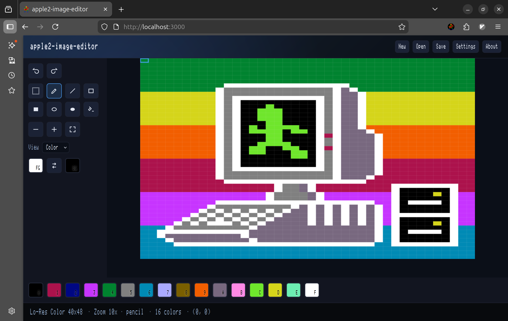

# apple2-image-editor

Simple image editor for Apple II GR, DGR, HGR and DHGR modes.

## Features

- Supported formats:
  - GR (Lo-Res) 40x48 16 colors
  - DGR (Double Lo-Res) 80x48 16 colors
  - HGR (Hi-Res) Color 140x192 6 colors
  - HGR (Hi-Res) Mono 280x192 2 colors
  - DHGR (Double Hi-Res) Color 140x192 16 colors
  - DHGR (Double Hi-Res) Mono 560x192 2 colors
  - generic pixmap (8bits per pixel)
  - generic bitmap (1bit per pixel)
- Save as modern image format(.png, .jpg, .webp, ...)
- Tools
  - Pencil
  - Line
  - Rect
  - Fill
  - Swap FG/BG colors
- Keyboard support
  - Arrow keys: move caret
  - Ctrl+Arrow keys: draws a pixel then move caret
  - `D` or mouse left click: draws FG
  - `E` or Ctrl+mouse left click: draws BG
  - `S`: swap colors
  - `Ctrl+Z`/`Ctrl+Y`: undo/redo
  - `+`/`-` or `Ctrl+MouseWheel`: zoom
- TODO: save/load images to/from Apple II disk images (dsk, 2mg).
- TODO: compress and decompress images using lz4, lzsa, zx02

## How it looks



## How to run

- Simplest way: https://iolo.kr/apple2-image-editor/

- or Clone source and Open index.html in a web browser without server.

- or Clone source and Install dependencies and `npm start`

```bash
git clone
cd apple2-image-editor
npm install
npm start
```

## See also

- [apple2-image-converter](https://github.com/iolo/apple2-image-converter) by me
- [HgrTool](https://github.com/fadden/HGRTool) by [Andy McFadden](https://fadden.com)

---
May the **SOURCE** be with you...
